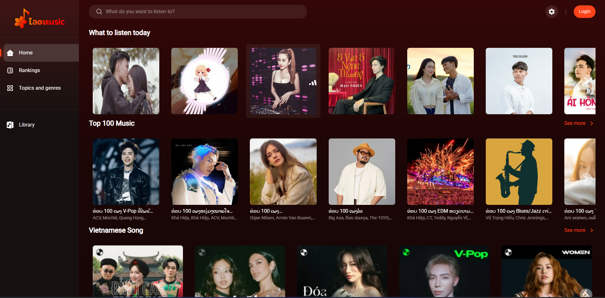

## Cài đặt

1. yarn
2. Copy file .env.example vào .env.development.local Có thể điều chỉnh nếu cần
3. yarn dev

## Biến môi trường (env)

-   Biến bắt buộc phải có tiền tố: `VITE`. Ví dụ: VITE_API_BASE_URL
-   Khi thêm biến môi trường mới, cần phải thêm vào file `.env.example` và thêm kiểu của biến vào file `src/vite-env.d.ts`
-   Để truy cập biến môi trường, sử dụng `import.meta.env`

## Ảnh giao diện demo

### 1. Trang chủ

  
  

### 2. Modal Login

  

### 3. Modal Setting

  

### 4. SideBar

  

